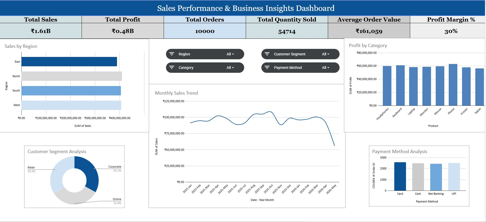
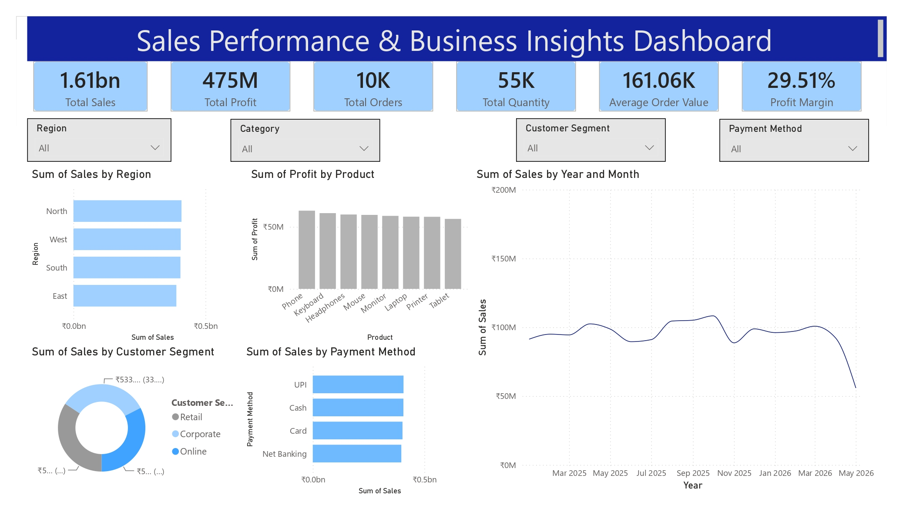

# 📈 Sales Performance & Business Insights Dashboard

## Dashboard Preview – Google Sheets

---

## Dashboard Preview – Power BI

---

## Project Overview

This project presents a Sales Performance & Business Insights Dashboard developed using both Google Sheets and Power BI.

The dashboard provides a comprehensive view of sales performance, customer behavior, product performance, profitability, and regional business trends. It helps business leaders and decision-makers monitor key sales metrics and identify opportunities for growth.

---

## Business Problem

Organizations generate large amounts of sales data across customers, products, regions, and sales channels.

Management requires a centralized analytics solution to:

* Monitor sales performance
* Track revenue and profitability
* Analyze customer purchasing behavior
* Evaluate product performance
* Identify regional sales trends
* Support strategic business decisions

---

## Dashboard Objectives

* Improve visibility into sales performance
* Monitor revenue and profit trends
* Analyze customer and product performance
* Identify top-performing regions
* Track order and sales volume
* Support data-driven business growth

---

## Key Metrics Tracked

* Total Sales
* Total Profit
* Profit Margin %
* Total Orders
* Total Quantity Sold
* Customer Count
* Product Count
* Regional Performance
* Category Performance
* Average Order Value

---

## Dashboard Features

### Executive KPI Summary

Provides a high-level overview of business performance.

### Revenue Analysis

Tracks sales trends and revenue growth.

### Profitability Analysis

Monitors profit performance across products and categories.

### Customer Analysis

Evaluates customer purchasing behavior and contribution.

### Product Performance

Identifies top-selling and underperforming products.

### Regional Analysis

Compares business performance across regions and markets.

### Sales Trend Analysis

Tracks sales growth over time.

---

## Tools & Technologies

### Google Sheets

* Pivot Tables
* Charts
* Dashboard Design
* Conditional Formatting
* KPI Reporting

### Power BI

* Power Query
* DAX
* Data Modeling
* Interactive Dashboards
* Data Visualization

---

## Skills Demonstrated

* Sales Analytics
* Business Performance Analysis
* KPI Development
* Dashboard Design
* Data Cleaning
* Data Transformation
* Revenue Analysis
* Profitability Analysis
* Customer Analytics
* Business Intelligence Reporting

---

## Business Insights Generated

* Identified top-performing products and categories.
* Evaluated customer contribution to revenue.
* Analyzed regional sales performance.
* Tracked revenue and profit growth trends.
* Supported strategic business decision-making through KPI reporting.

---

## Author

### John G Varghese

Data Analyst | Power BI Developer | Google Sheets Dashboard Specialist

GitHub: https://github.com/johngvarghese
